# Архитектура проекта AIOps Dashboard

## Содержание

1. [Общая архитектура](#общая-архитектура)
2. [Компоненты системы](#компоненты-системы)
3. [Docker инфраструктура](#docker-инфраструктура)
4. [Поток данных](#поток-данных)
5. [Взаимодействие компонентов](#взаимодействие-компонентов)
6. [Схема базы данных](#схема-базы-данных)
7. [Процесс аутентификации](#процесс-аутентификации)
8. [Структура кода](#структура-кода)

---

## Общая архитектура

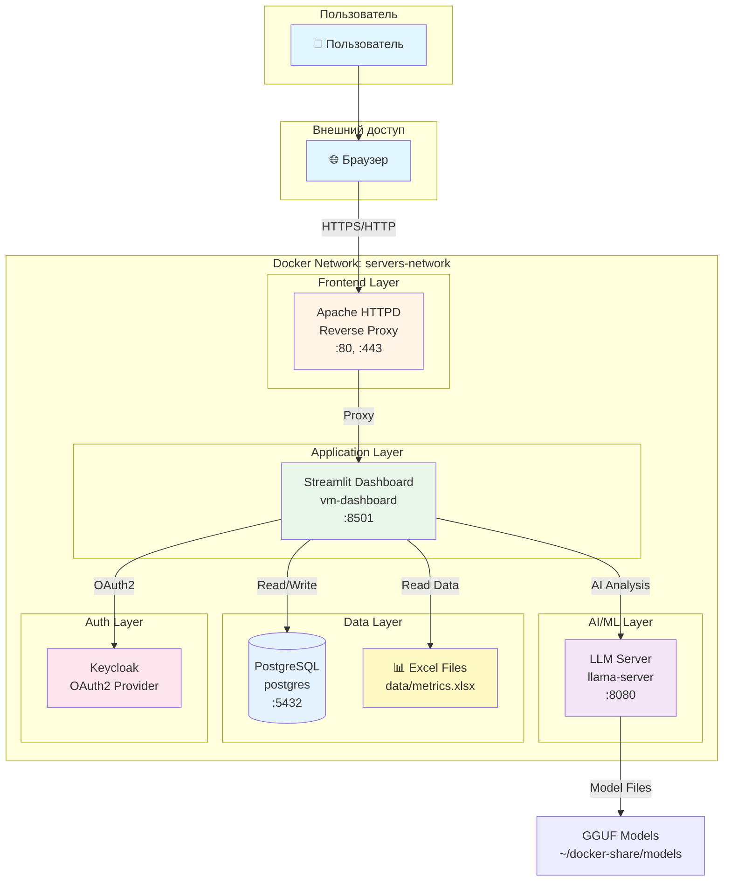

---

## Компоненты системы

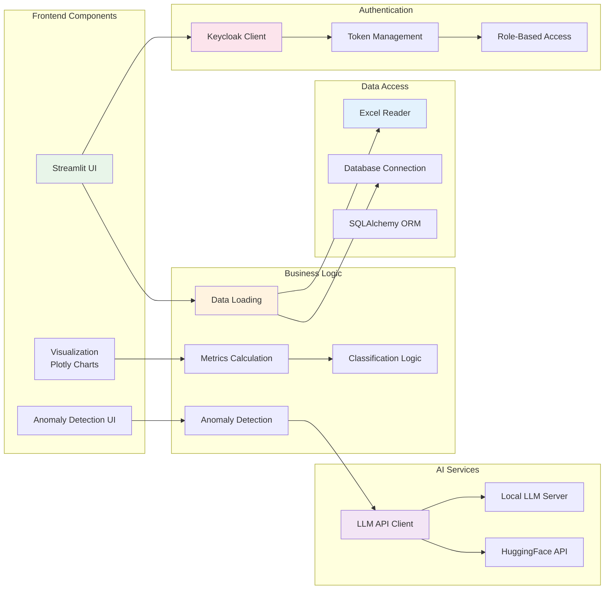

---

## Docker инфраструктура

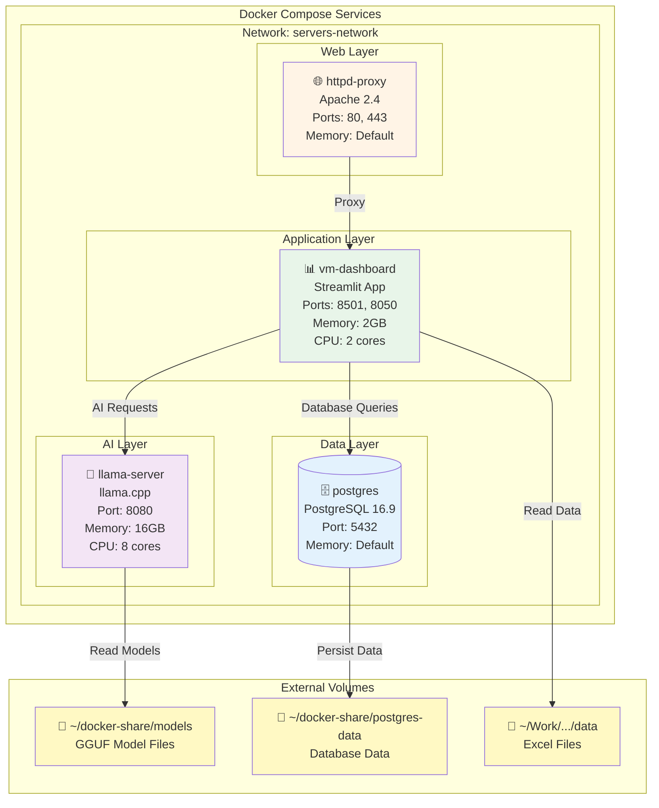

### Зависимости сервисов

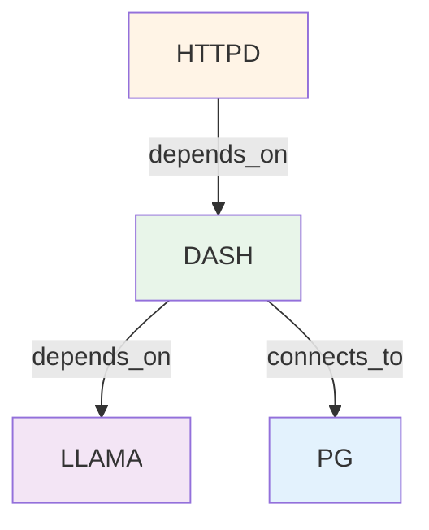

---

## Поток данных

### Текущий поток (Excel-based)

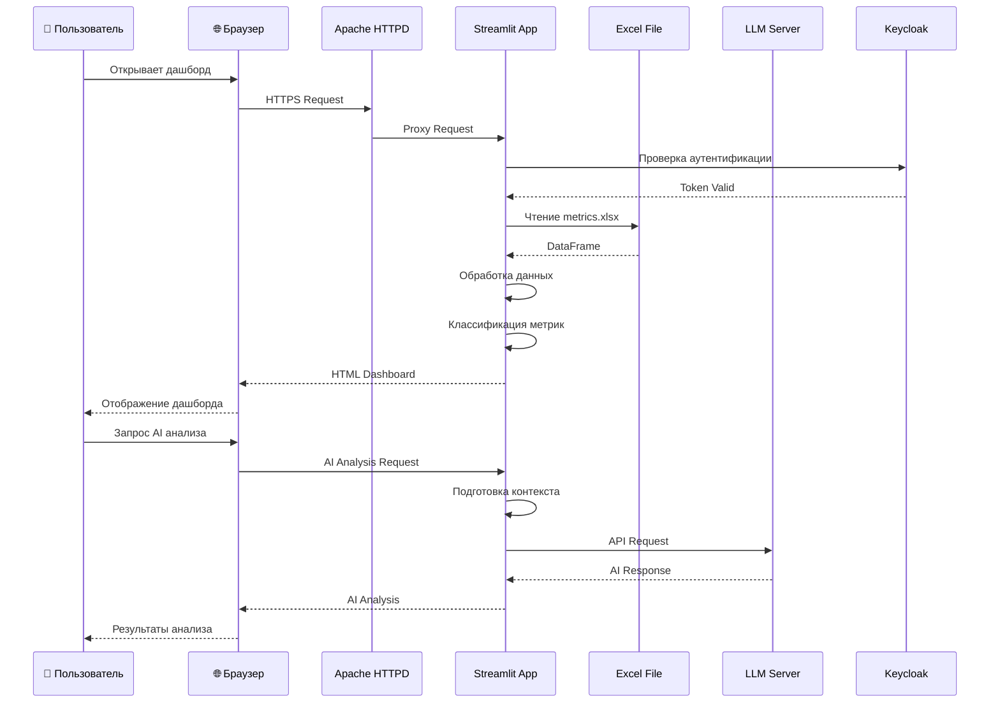

### Целевой поток (Database-based)

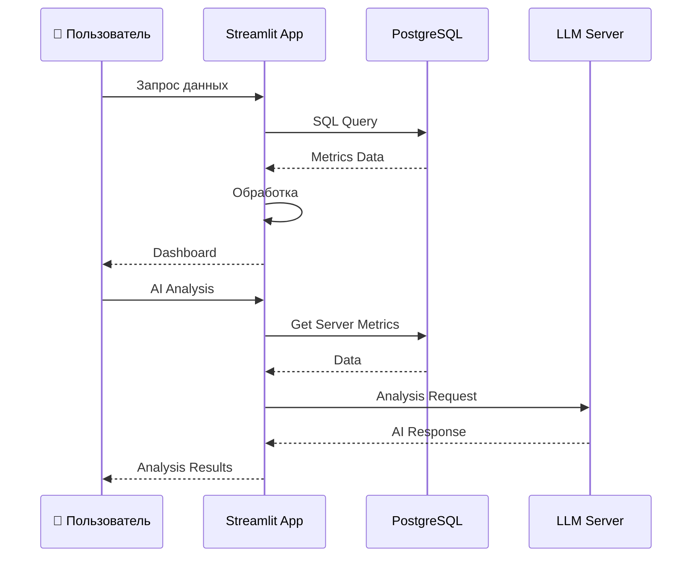

---

## Взаимодействие компонентов

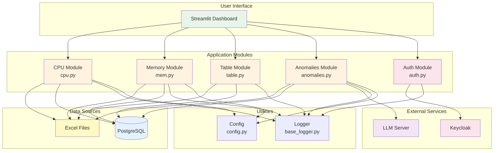

---

## Схема базы данных

### ER-диаграмма

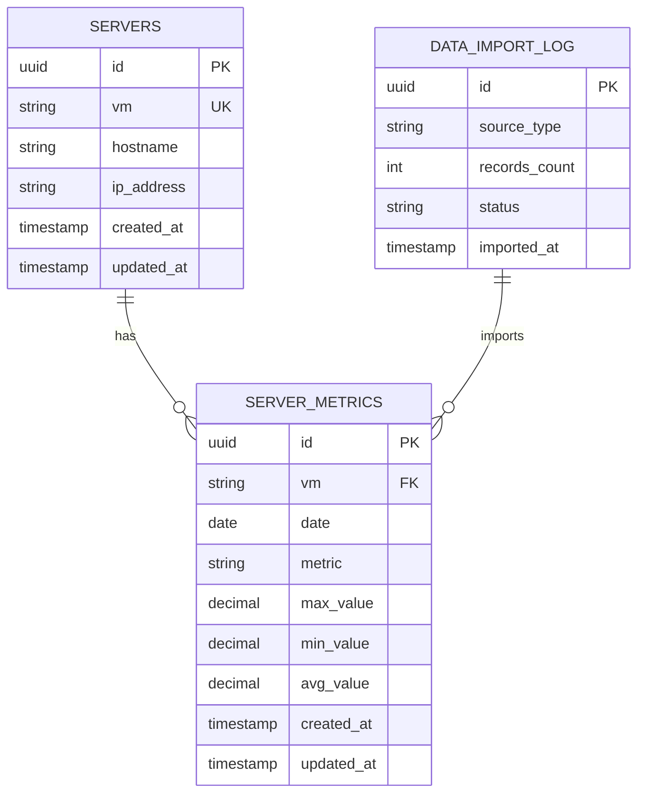

### Схема таблицы server_metrics

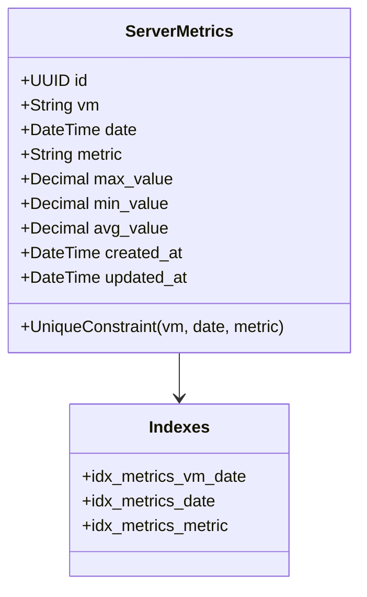

### Примеры метрик

| metric | Описание | Единица измерения |
|--------|----------|-------------------|
| `cpu.usage.average` | Средняя загрузка CPU | % |
| `mem.usage.average` | Среднее использование памяти | % |
| `disk.usage.average` | Среднее использование диска | KB/s |
| `net.usage.average` | Среднее использование сети | KB/s |

---

## Процесс аутентификации

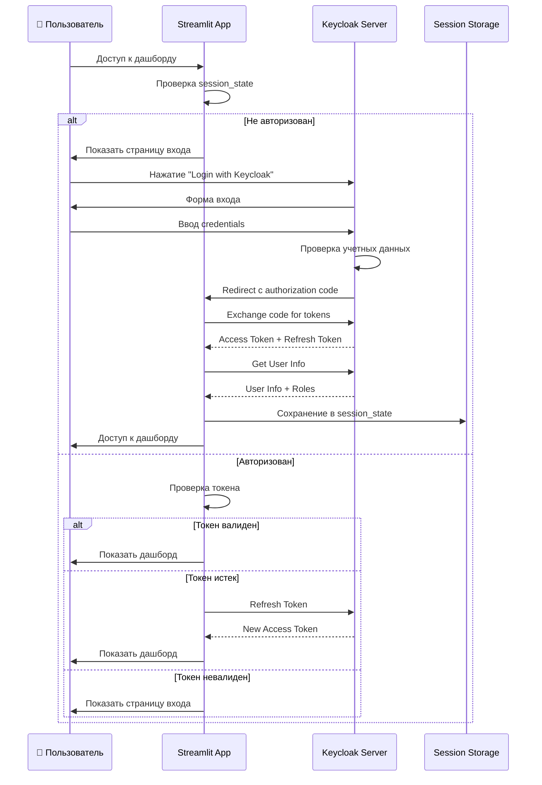

### Роли и права доступа

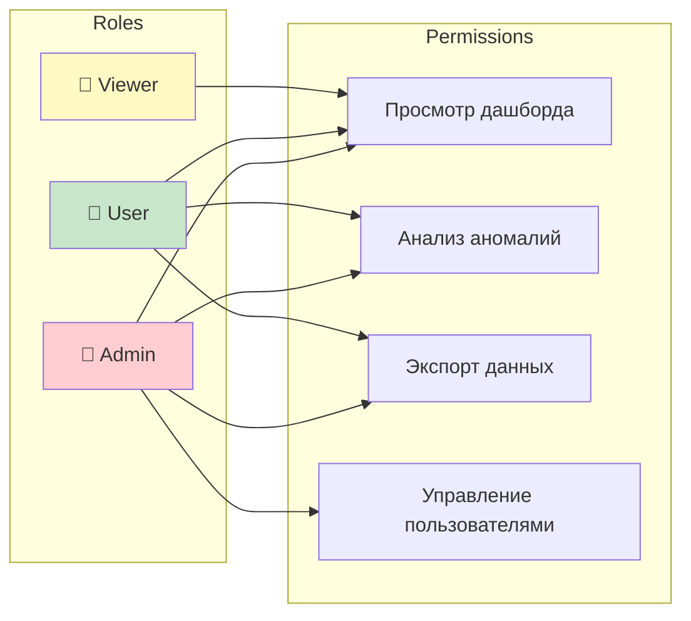

---

## Структура кода

### Модульная структура

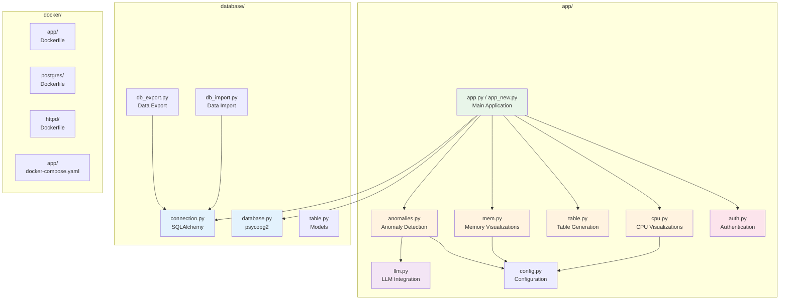

### Зависимости модулей

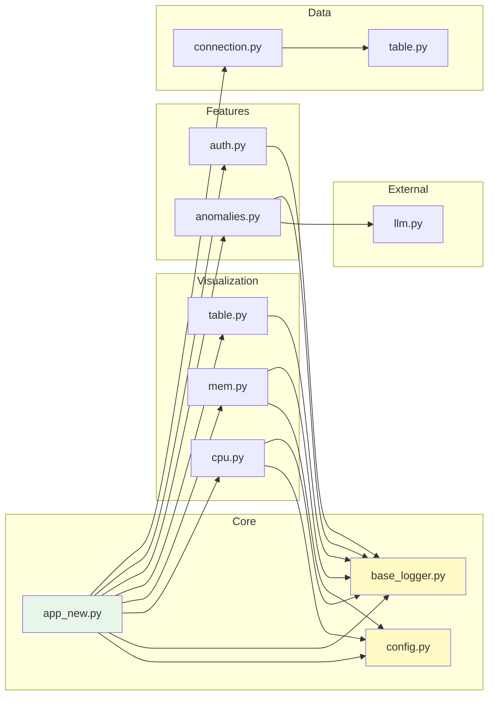

---

## Поток обработки данных

### Процесс загрузки и обработки

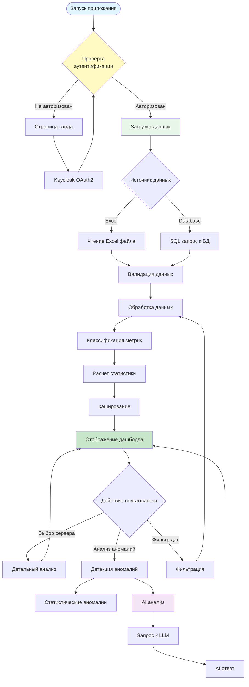

---

## Интеграция с LLM

### Стратегия fallback

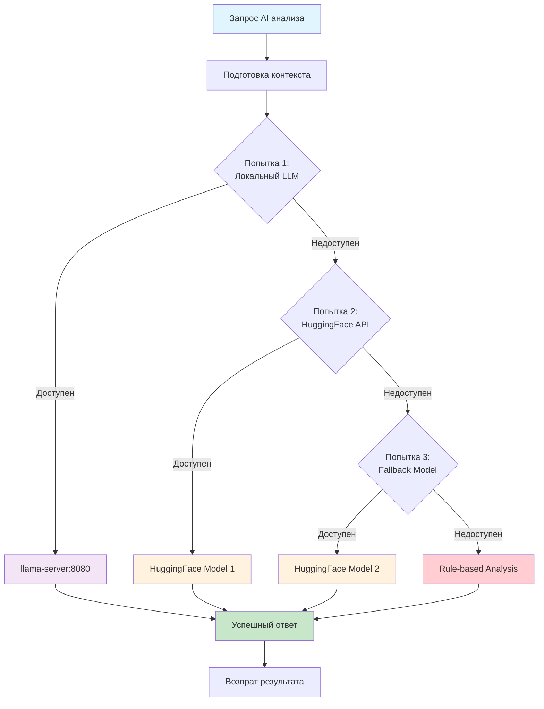

---

## Схема развертывания

### Production Deployment

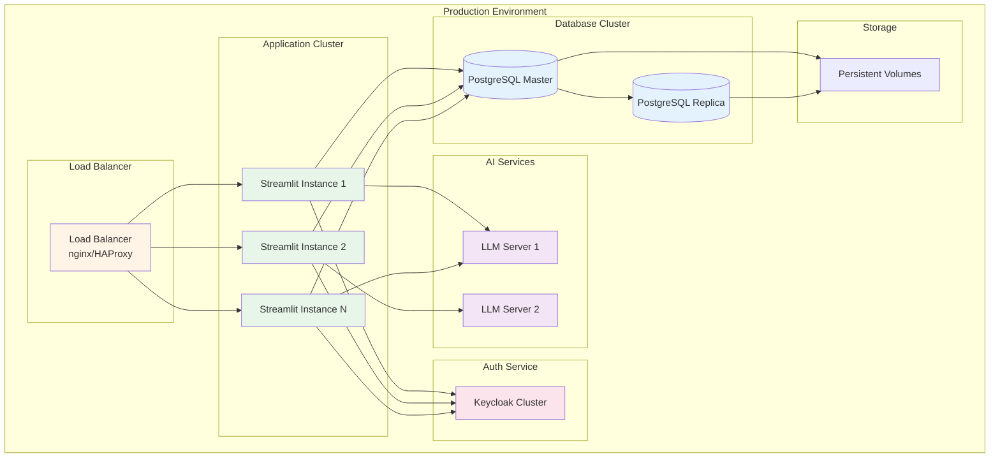

---

## Технические характеристики

### Ресурсы контейнеров

| Сервис | CPU | Memory | Порты | Описание |
|--------|-----|--------|-------|----------|
| `vm-dashboard` | 2 cores | 2 GB | 8501, 8050 | Streamlit приложение |
| `llama-server` | 8 cores | 16 GB | 8080 | LLM inference сервер |
| `postgres` | Default | Default | 5432 | База данных |
| `httpd-proxy` | Default | Default | 80, 443 | Reverse proxy |

### Порты и endpoints

| Сервис | Порт | Endpoint | Описание |
|--------|------|----------|----------|
| HTTPD | 80 | `/` | HTTP (redirect to HTTPS) |
| HTTPD | 443 | `/dashboard` | HTTPS proxy to Streamlit |
| Streamlit | 8501 | `/` | Main dashboard |
| LLM Server | 8080 | `/completion` | LLM API |
| PostgreSQL | 5432 | - | Database connection |

---

## Легенда диаграмм

### Цветовая схема

- 🟢 **Зеленый** - Application/UI компоненты
- 🟡 **Желтый** - Configuration/Utilities
- 🔵 **Синий** - Data/Database компоненты
- 🟣 **Фиолетовый** - AI/ML компоненты
- 🔴 **Красный** - Authentication/Security
- 🟠 **Оранжевый** - Infrastructure/Network

### Символы

- 👤 - Пользователь
- 🌐 - Веб-браузер
- 📊 - Данные/Файлы
- 🗄️ - База данных
- 🤖 - AI/ML сервис
- 🔐 - Аутентификация
- 📁 - Хранилище/Volumes

---

**Дата создания:** Январь 2025  
**Версия:** 1.0  
**Статус:** Текущая архитектура (с рекомендациями по улучшению)

